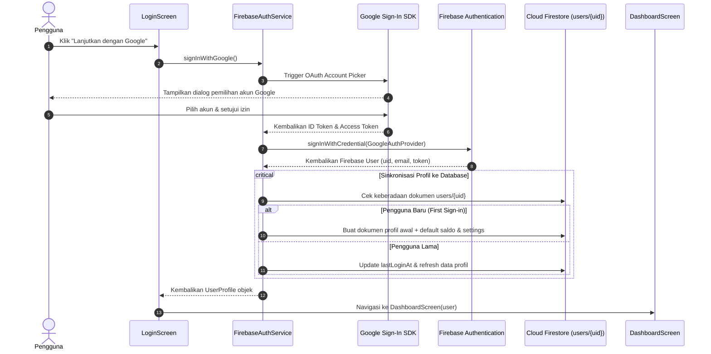

# 🔐 Fitur Autentikasi (Auth) - TrackFinance

Dokumentasi ini mencakup seluruh arsitektur, panduan teknis, spesifikasi skema data, serta *task breakdown* khusus untuk **Fitur Autentikasi** berbasis **Firebase Authentication (Google OAuth 2.0)**.

---

## 🎯 Gambaran Umum Fitur

Fitur Autentikasi bertanggung jawab untuk mengelola siklus hidup identitas pengguna (*identity & session lifecycle*) pada aplikasi TrackFinance:
- **Metode Masuk**: Google OAuth 2.0 (One-tap / authentic Google Account picker).
- **Session Persistence**: Firebase Auth secara otomatis mengelola token JWT, refresh token, dan status login antar-sesi aplikasi (*auto-login* saat aplikasi dibuka kembali).
- **Auto-Sync Profil Pengguna**: Sinkronisasi data akun (`uid`, `email`, `displayName`, `photoUrl`) ke dokumen Firestore `users/{uid}` saat login pertama kali maupun pembaruan akun.
- **Single Line Provider Switch**: Menggunakan pola *Dependency Inversion* (`AuthService`), transisi dari `MockAuthService` ke `FirebaseAuthService` dilakukan hanya dengan mengganti satu baris kode di `lib/core/services/auth_service_provider.dart`.

---

## 🔄 Alur Kerja Autentikasi (Authentication Flow)

---

## 📑 Daftar Dokumen Fitur Auth

| Dokumen | Deskripsi |
| :--- | :--- |
| [📋 Task Breakdown Auth](file:///Users/heru/Development/TrackFinance/docs/auth/task_breakdown.md) | Daftar tugas implementasi fitur Auth per tahap, estimasi waktu, dan Definition of Done (DoD). |
| [🔑 Panduan Setup Google OAuth](file:///Users/heru/Development/TrackFinance/docs/auth/google_oauth_guide.md) | Langkah teknis SHA-1/256, Firebase Console, konfigurasi Gradle Android, iOS Info.plist, dan implementasi kode Flutter. |
| [🗄️ Struktur Database User (Firestore)](file:///Users/heru/Development/TrackFinance/docs/auth/database_structure.md) | Struktur data pengguna di Firebase Auth, dokumen `users/{uid}` di Cloud Firestore, dan aturan keamanannya. |

---

## 🛠️ Ringkasan Identitas Aplikasi

- **Android Package / Application ID**: `com.trackfinance.TrackFinance`
- **iOS Bundle Identifier**: `com.trackfinance.trackFinance`
- **Firebase Auth Provider**: Google OAuth 2.0
