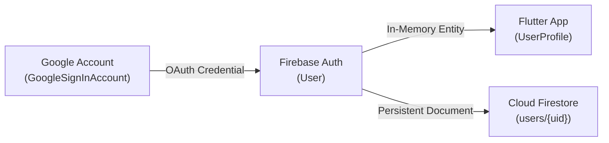

# 🗄️ Struktur Database & Skema Pengguna (Auth)

Dokumen ini mendefinisikan struktur database NoSQL Cloud Firestore untuk data pengguna (`users/{uid}`), relasi dengan Firebase Auth (`User`), model Flutter (`UserProfile`), logika sinkronisasi (*upsert*), serta aturan keamanan (*Security Rules*).

---

## 🏗️ Pemetaan Model Data



---

## 1. Model Flutter: `UserProfile`

File: [frontend/lib/core/models/user_profile.dart](file:///Users/heru/Development/TrackFinance/frontend/lib/core/models/user_profile.dart)

```dart
class UserProfile {
  final String uid;
  final String? email;
  final String? displayName;
  final String? photoUrl;

  const UserProfile({
    required this.uid,
    this.email,
    this.displayName,
    this.photoUrl,
  });

  factory UserProfile.fromMap(Map<String, dynamic> map);
  Map<String, dynamic> toMap();
}
```

---

## 2. Dokumen Firestore: `users/{uid}`

Setiap akun pengguna memiliki tepat satu dokumen root di Cloud Firestore pada path `users/{uid}`.

### Spesifikasi Field

| Field | Tipe Data | Deskripsi | Wajib? | Nilai Default |
| :--- | :--- | :--- | :---: | :--- |
| `uid` | `string` | ID unik pengguna dari Firebase Auth (Primary Key). | Ya | `user.uid` |
| `email` | `string` | Alamat email Google terdaftar. | Ya | `user.email` |
| `displayName` | `string` | Nama lengkap pengguna dari Google. | Opsional | `user.displayName` |
| `photoUrl` | `string` | URL foto profil avatar dari Google. | Opsional | `user.photoURL` |
| `currency` | `string` | Kode mata uang preferensi pengguna. | Ya | `"IDR"` |
| `totalBalance` | `number` | Akumulasi total saldo saat ini dalam Rupiah. | Ya | `0` |
| `financialHealthScore`| `int` | Skor kesehatan finansial (skala 0 - 100). | Ya | `85` |
| `settings` | `map` | Preferensi aplikasi (tema, biometrik, notifikasi). | Ya | `{ biometricEnabled: false, darkMode: false }` |
| `createdAt` | `timestamp`| Waktu pertama kali akun dibuat di database. | Ya | `FieldValue.serverTimestamp()` |
| `lastLoginAt` | `timestamp`| Waktu terakhir pengguna melakukan proses login. | Ya | `FieldValue.serverTimestamp()` |

### Contoh Dokumen JSON:
```json
{
  "uid": "ABcd1234EFgh5678",
  "email": "alex.pratama@gmail.com",
  "displayName": "Alex Pratama",
  "photoUrl": "https://lh3.googleusercontent.com/a/ACg8oc...",
  "currency": "IDR",
  "totalBalance": 0,
  "financialHealthScore": 85,
  "settings": {
    "biometricEnabled": false,
    "darkMode": false,
    "pushNotification": true
  },
  "createdAt": "2026-10-10T10:00:00.000Z",
  "lastLoginAt": "2026-10-10T17:30:00.000Z"
}
```

---

## 3. Logika Upsert Dokumen Pengguna

Saat fungsi `signInWithGoogle()` berhasil dieksekusi, service akan menjalankan mekanisme **Upsert** (*Update if exists, Insert if not*):

```dart
Future<void> _syncUserProfileToFirestore(User user) async {
  final userRef = _firestore.collection('users').doc(user.uid);
  final userDoc = await userRef.get();

  final now = FieldValue.serverTimestamp();

  if (!userDoc.exists) {
    // Pengguna Baru (First Time)
    await userRef.set({
      'uid': user.uid,
      'email': user.email,
      'displayName': user.displayName,
      'photoUrl': user.photoURL,
      'createdAt': now,
      'lastLoginAt': now,
      'currency': 'IDR',
      'totalBalance': 0,
      'financialHealthScore': 85,
      'settings': {
        'biometricEnabled': false,
        'darkMode': false,
        'pushNotification': true,
      },
    });
  } else {
    // Pengguna Lama (Pembaruan waktu login)
    await userRef.update({
      'email': user.email,
      'displayName': user.displayName,
      'photoUrl': user.photoURL,
      'lastLoginAt': now,
    });
  }
}
```

---

## 4. Aturan Keamanan Firestore untuk Data Pengguna

Data pengguna dilindungi secara mutlak menggunakan aturan berikut:

```javascript
match /users/{userId} {
  // Hanya pemilik akun yang dapat membaca profilnya
  allow read: if request.auth != null && request.auth.uid == userId;

  // Hanya pemilik akun yang dapat membuat dan memperbarui dokumen profilnya
  allow create: if request.auth != null && request.auth.uid == userId && request.resource.data.uid == userId;
  allow update: if request.auth != null && request.auth.uid == userId;

  // Dilarang menghapus akun secara sembarangan
  allow delete: if false;
}
```
