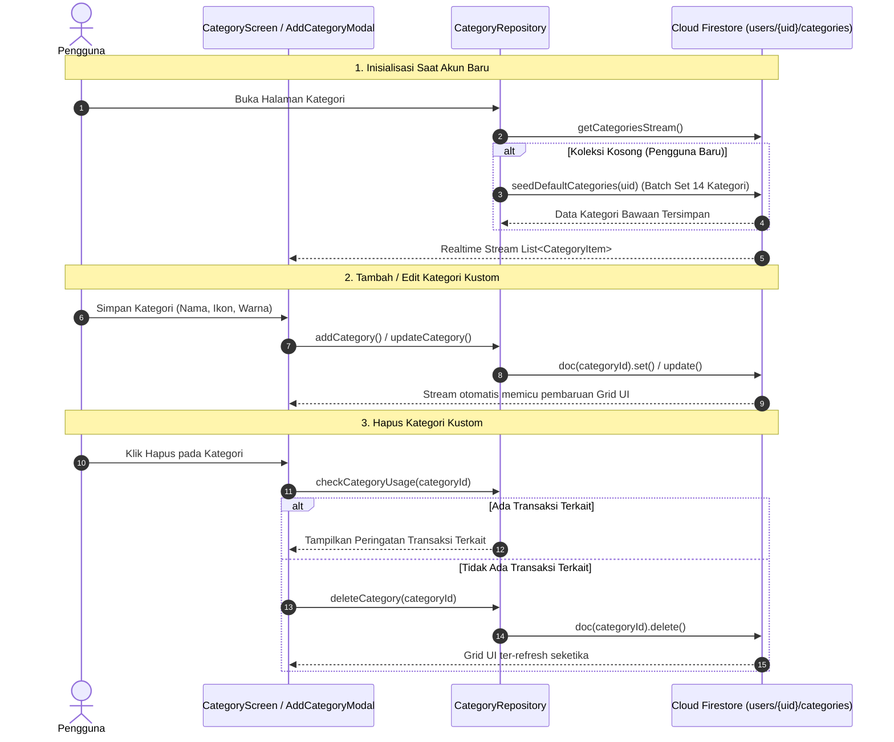

# 🏷️ Fitur Manajemen Kategori (Categories) - TrackFinance

Dokumentasi ini mencakup arsitektur, panduan teknis, spesifikasi skema Cloud Firestore, serta *task breakdown* langkah-demi-langkah untuk mengimplementasikan backend **Fitur Manajemen Kategori & Alokasi** menggunakan **Firebase SDK**.

---

## 🎯 Gambaran Umum Fitur

Fitur Manajemen Kategori memungkinkan pengguna mengelola klasifikasi arus kas mereka secara fleksibel:
- **Tipe Kategori**: Mendukung pemisahan kategori **Pengeluaran** (*Expense*) dan **Pemasukan** (*Income*).
- **Kategori Bawaan Sistem (Default Categories)**: Otomatis diisi saat akun pengguna pertama kali dibuat (8 kategori pengeluaran dan 6 kategori pemasukan). Kategori sistem berstatus `isLocked: true` untuk kategori "Lainnya" agar integritas data transaksi selalu terjaga.
- **Kustomisasi Penuh (Custom Categories)**: Pengguna dapat menambah, mengedit (nama, palet warna, dan 12+ pilihan ikon *Material rounded*), serta menghapus kategori buatan sendiri.
- **Realtime Synchronization**: Perubahan kategori disinkronisasikan secara instan ke Cloud Firestore via `snapshots()` stream, sehingga langsung ter-update di antarmuka pemilihan transaksi maupun grafik alokasi.
- **Proteksi Integritas Data**: Mencegah penghapusan kategori jika masih terkait dengan riwayat transaksi yang ada, atau mengarahkan ke kategori fallback ("Lainnya").

---

## 🔄 Alur Kerja Data Kategori (Data Flow & Architecture)

---

## 📑 Daftar Dokumen Fitur Categories

| Dokumen | Deskripsi |
| :--- | :--- |
| [📋 Task Breakdown Categories](file:///Users/heru/Development/TrackFinance/docs/categories/task_breakdown.md) | Daftar tugas implementasi per tahap, estimasi waktu, prioritas (P0 - P2), dan Definition of Done (DoD). |
| [🗄️ Struktur Database Categories](file:///Users/heru/Development/TrackFinance/docs/categories/database_structure.md) | Spesifikasi dokumen Firestore `users/{uid}/categories/{categoryId}`, validasi skema, dan indexing. |
| [🛠️ Panduan Implementasi Teknis](file:///Users/heru/Development/TrackFinance/docs/categories/implementation_guide.md) | Panduan teknis kode Flutter: pembuatan `CategoryRepository`, seeding batch, serialisasi DTO, dan integrasi UI. |

---

## 🏗️ Kategori Bawaan Sistem (Default Categories)

### 🔴 Pengeluaran (Expense - 8 Kategori)
1. **Makanan & Minuman** (Ikon: `restaurant_rounded`, Warna: Merah `#DC2626`)
2. **Transportasi** (Ikon: `two_wheeler_rounded`, Warna: Biru `#2563EB`)
3. **Belanja Harian** (Ikon: `shopping_bag_rounded`, Warna: Hijau `#16A34A`)
4. **Tagihan & Pulsa** (Ikon: `receipt_long_rounded`, Warna: Merah `#DC2626`)
5. **Kesehatan** (Ikon: `medical_services_rounded`, Warna: Hijau `#16A34A`)
6. **Hiburan Seru** (Ikon: `sports_esports_rounded`, Warna: Biru `#2563EB`)
7. **Pendidikan** (Ikon: `school_rounded`, Warna: Biru Tua `#1E40AF`)
8. **Lainnya** (Ikon: `more_horiz_rounded`, Warna: Biru `#2563EB`, Terkunci `isLocked: true`)

### 🟢 Pemasukan (Income - 6 Kategori)
1. **Gaji Pokok** (Ikon: `payments_rounded`, Warna: Hijau `#16A34A`)
2. **Bonus** (Ikon: `card_giftcard_rounded`, Warna: Biru `#2563EB`)
3. **Investasi** (Ikon: `trending_up_rounded`, Warna: Hijau `#16A34A`)
4. **Penjualan** (Ikon: `storefront_rounded`, Warna: Biru Tua `#1E40AF`)
5. **Freelance** (Ikon: `laptop_mac_rounded`, Warna: Biru `#2563EB`)
6. **Lainnya** (Ikon: `more_horiz_rounded`, Warna: Hijau `#16A34A`, Terkunci `isLocked: true`)
